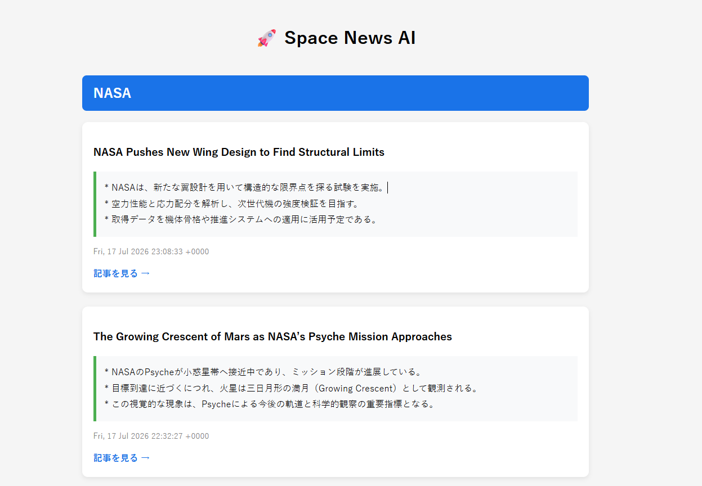

# 🚀 Space News AI

AIが宇宙ニュースを自動収集・要約し、Web画面へ表示するローカルニュースアプリです。

現在は NASA・JAXA・ESA・SpaceNews のRSSを取得し、
Gemma4（Ollama）を利用して日本語で要約を生成しています。

---

## Screenshot



---

## Features

- RSSニュース自動取得
- NASA
- JAXA
- ESA
- SpaceNews対応
- AIによる日本語要約
- FlaskによるWeb表示
- 配信元ごとのグループ表示
- ローカルLLM対応（Ollama）

---

## Technology Stack

### Backend

- Python
- Flask

### AI

- Ollama
- Gemma4

### Data

- RSS
- JSON

### Frontend

- HTML
- CSS
- Jinja2

### Version Control

- Git
- GitHub

---

## Project Structure

```
space-news/

├── app.py
├── main.py
├── config.py

├── news/
│   ├── fetch.py
│   ├── summarizer.py
│   ├── save.py
│   └── load.py

├── templates/
│   └── index.html

├── static/
│   └── style.css

├── data/
│   └── news.json

└── README.md
```

---

## Workflow

RSS

↓

Python

↓

Gemma4 (Ollama)

↓

JSON保存

↓

Flask

↓

Browser

---

## Setup

```bash
git clone https://github.com/2019ng0616-bit/space-news.git

cd space-news

python -m venv .venv

.\.venv\Scripts\activate

pip install -r requirements.txt
```

---

## Run

ニュース取得

```bash
python main.py
```

Web表示

```bash
python app.py
```

ブラウザ

```
http://127.0.0.1:5000
```

---

## Roadmap

- [x] RSS取得
- [x] Flask表示
- [x] AI要約
- [x] 配信元ごと表示
- [ ] README改善
- [ ] 重要ニュース判定
- [ ] タグ生成
- [ ] 日本版・海外版切替
- [ ] キーワード検索
- [ ] 自動更新
- [ ] スマホ最適化
- [ ] 公開版リリース

---

## Author

Mahiro

---

## License

MIT License